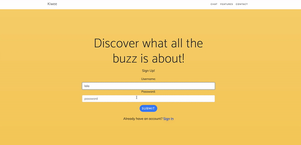

# Kiwee Video Chat Application

This is a video chat application built with NodeJS, Express and Web Sockets using MongoDB and passportJS for authentication. 

To install the program:

1) clone or download this project.

2) navigate to the project directory and run
    
    `npm install`

    to install the project dependencies.

3) Navigate to the public folder and run `npm install` to install the dependencies for the bootstrap template.

